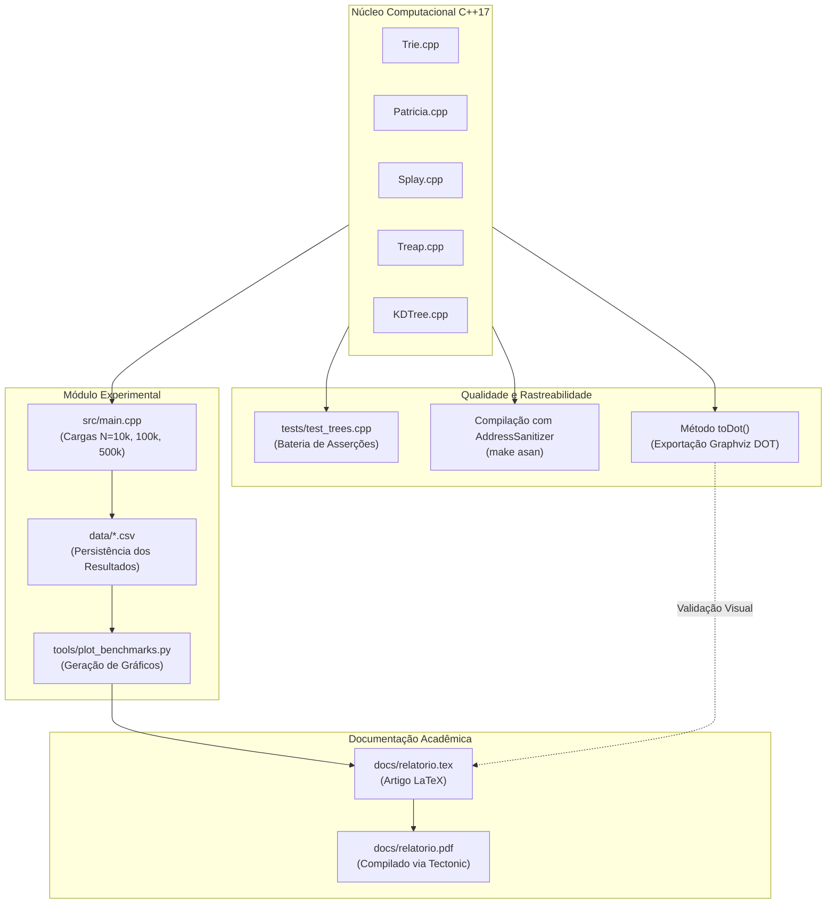
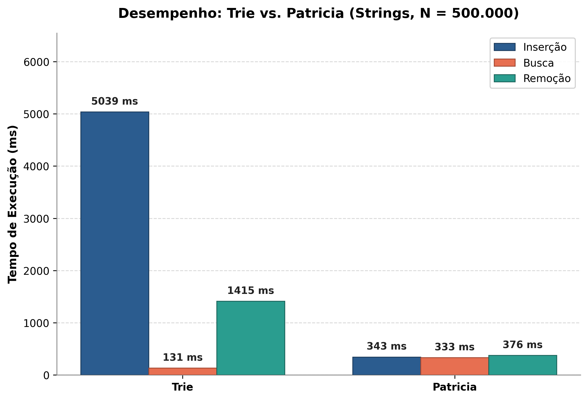
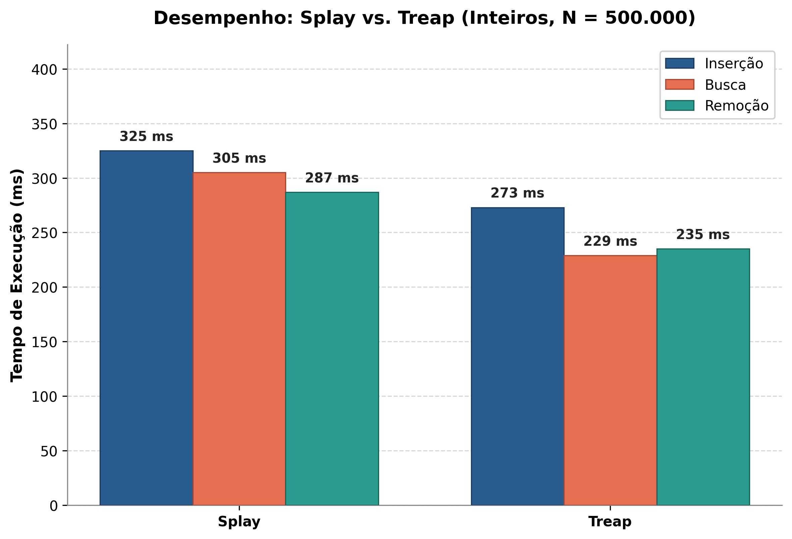
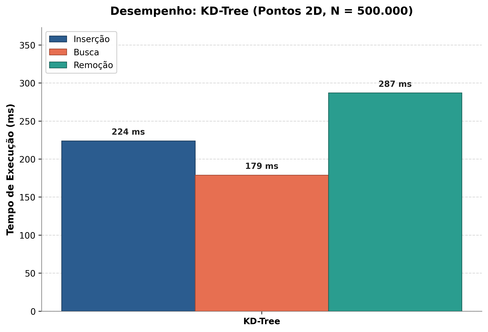
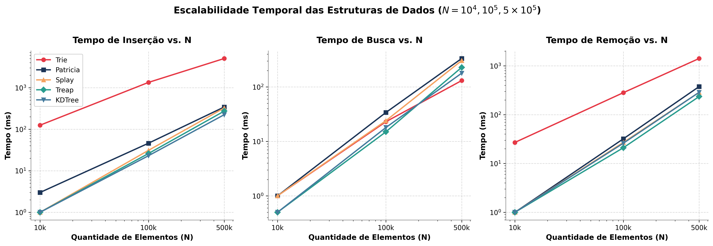

# 🌳 Estruturas em Árvores Avançadas: Modelagem, Análise Teórica e Avaliação Empírica 🌳

<p align="center">
  
  
  
  
  
  
  <a href="https://github.com/HeitorHenriqueZ/Trabalho_Arvores">
    
  </a>
</p>

## 📃 Introdução

Árvores Binárias de Busca convencionais (BST) e Árvores AVL organizam dados sob ordem total unidimensional. Embora eficientes no caso geral, essas estruturas clássicas revelam gargalos críticos em cenários do mundo real:

1. **Cadeias de caracteres (strings):** comparações de chaves de comprimento $m$ custam $O(m)$ por nó visitado, elevando a busca em BST e AVL a $O(m \log n)$;
2. **Localidade temporal de referência:** padrões de acesso assimétricos (regra 80-20 ou distribuição de Zipf) não alteram a topologia de busca da AVL estática;
3. **Espaço multidimensional:** pontos ou tuplas $(x, y, \ldots)$ não admitem ordenação total linear natural.

Este projeto investiga **cinco estruturas hierárquicas avançadas de dados** projetadas para superar tais limitações: **Trie**, **Árvore Patricia** (Radix Tree compacta), **Árvore Splay**, **Árvore Treap** e **KD-Tree ($K=2$)**. O trabalho combina fundamentação teórica rigorosa, implementação computacional em **C++17**, análise assintótica formal contra BST/AVL e avaliação experimental escalável para volumes de até **$N = 500.000$ elementos** por estrutura, sob validação estrita de memória (AddressSanitizer) e rastreabilidade visual.

## 📑 Descrição do Projeto

Trabalho prático individual proposto pelo professor **Michel Pires Silva**, da disciplina *Algoritmos e Estruturas de Dados II* (AEDS II), do Centro Federal de Educação Tecnológica de Minas Gerais (**CEFET-MG**), Campus V, Divinópolis.

O sistema implementa, testa e avalia cinco estruturas especializadas:

### 📌 1. Árvore Trie (Árvore de Prefixos)
Estrutura digital onde cada aresta corresponde a um símbolo de um alfabeto finito $\Sigma$ (nesta implementação, $|\Sigma| = 256$ valores de byte). O caminho da raiz a um nó determina o prefixo compartilhado pelas chaves. Suporta busca por prefixo (`startsWith`) e busca exata em tempo estritamente proporcional ao comprimento da chave ($O(m)$), independente do número de chaves armazenadas ($N$).

### 📌 2. Árvore Patricia (Radix Tree Compacta)
Compacta os caminhos unários da Trie clássica: todo nó interno não-terminal, exceto a raiz sentinela, possui grau de saída $\ge 2$, e trechos de caracteres contíguos sem bifurcação são fundidos em uma única aresta rotulada (`prefix`). Implementa cisão sob demanda (*split*) durante a inserção e fusão (*merge*) de nós na remoção, reduzindo o número de nós para no máximo $2N$, incluindo a raiz sentinela, para $N \ge 1$. A árvore vazia mantém apenas a raiz.

### 📌 3. Árvore Splay (Autoajustável)
Árvore binária de busca sem metadados adicionais de balanceamento (sem campos de altura ou cor). Cada operação de acesso (`search`, `insert`, `remove`) reorganiza a topologia via rotações locais coordenadas (**Zig**, **Zig-Zig** e **Zig-Zag**), promovendo o elemento acessado até a raiz. Apresenta complexidade amortizada $O(\log n)$ e adapta-se automaticamente a conjuntos de trabalho com alta localidade temporal (*working set*).

### 📌 4. Árvore Treap (Tree + Heap)
Estrutura híbrida que combina a invariante simétrica da BST para chaves escalares com a ordenação de Max-Heap para prioridades inteiras pseudoaleatórias geradas via Mersenne Twister (`std::mt19937`). A altura esperada é $O(\log n)$ independentemente da ordem de entrada, embora o pior caso continue sendo $O(n)$.

### 📌 5. KD-Tree (Árvore $K$-Dimensional, $K=2$)
Extensão espacial da partição binária para o plano bidimensional euclidiano $\mathbb{R}^2$. Alterna ciclicamente o eixo discriminante de corte ($\kappa = \mathrm{depth} \bmod K$). Além da busca exata e remoção com localização do substituto ótimo via `findMin`, o projeto implementa operações espaciais completas com poda de hiperplanos:
- **`nearestNeighbor`:** busca do ponto mais próximo a um alvo euclidiano, com custo esperado $O(\log n)$ sob distribuição favorável em baixa dimensão, e pior caso $O(n)$;
- **`rangeSearch`:** consulta por faixa ortogonal retangular $[\mathrm{low}, \mathrm{high}]$, com complexidade $O(\sqrt{n} + k)$ em uma árvore 2D balanceada e pior caso $O(n)$.

### 📌 Mapeamento de Requisitos

| Requisito do Enunciado | Implementação neste Projeto |
| :--- | :--- |
| **5 Estruturas Obrigatórias** | Trie, Patricia, Splay, Treap e KD-Tree ($K=2$) implementadas em C++17 modular. |
| **Operações Fundamentais** | `insert`, `search` e `remove` completas em todas as 5 árvores, com tratamento de duplicatas e casos de borda. |
| **Operações Específicas** | `startsWith` (Trie/Patricia), `splay` (Splay), rotações de Heap (Treap), `nearestNeighbor` e `rangeSearch` (KD-Tree). |
| **Demonstração Visual e Rastreabilidade** | 3 estados por estrutura (15 no total) gerados diretamente pelos métodos `toDot()` com `make diagrams`. |
| **Confrontação Teórica** | Tabela assintótica contraponto as 5 árvores à BST clássica e à Árvore AVL. |
| **Avaliação Experimental** | Medição empírica para $N \in \{10^4, 10^5, 5\cdot10^5\}$ com chaves uniformes, ordenadas e mistura de localidade 80-20. |
| **Artigo / Relatório Técnico** | Relatório de 12 páginas em LaTeX (`docs/relatorio.tex`), compilável via Tectonic. |

---

## 📁 Estrutura Geral do Projeto

O repositório adota organização modular e padronizada para sistemas C++ modernos:

```text
Trabalho_Arvores/
├── Makefile                       # Diretivas de compilação (-O3, -Wall, -Wextra, -pedantic, ASan)
├── README.md                      # Documentação completa do projeto (este arquivo)
├── include/                       # Cabeçalhos (.hpp) com interfaces, nós e invariantes
│   ├── KDTree.hpp                 # Declaração de Point, KDNode e classe KDTree
│   ├── Patricia.hpp               # Declaração de PatriciaNode e classe Patricia
│   ├── Splay.hpp                  # Declaração de SplayNode e classe SplayTree
│   ├── Treap.hpp                  # Declaração de TreapNode e classe Treap
│   └── Trie.hpp                   # Declaração de TrieNode e classe Trie
├── src/                           # Implementações (.cpp) com gerenciamento RAII
│   ├── KDTree.cpp                 # Implementação de corte ortogonal, findMin, NN e range search
│   ├── Patricia.cpp               # Implementação de split, merge e compactação de prefixos
│   ├── Splay.cpp                  # Implementação recursiva de Zig, Zig-Zig e Zig-Zag
│   ├── Treap.cpp                  # Implementação de Max-Heap estocástico e rotações de balanceamento
│   ├── Trie.cpp                   # Implementação da árvore de prefixos e desalocação recursiva
│   └── main.cpp                   # Rotina experimental de benchmarks para N = 10k, 100k e 500k
├── tests/                         # Bateria automatizada de testes de corretude
│   └── test_trees.cpp             # Testes unitários com assert de todas as operações e casos de borda
├── data/                          # Dados brutos persistidos dos ensaios empíricos
│   ├── benchmark_results.csv      # Tempos de inserção, busca e remoção por cardinalidade
│   ├── benchmark_memory.csv       # Ocupação de nós (Trie vs. Patricia)
│   ├── benchmark_distributions.csv # Dados ordenados e localidade 80-20
│   └── benchmark_spatial.csv      # Consultas espaciais da KD-Tree
├── docs/                          # Documentação acadêmica e visualizações
│   ├── relatorio.tex              # Fonte LaTeX do artigo técnico (12 páginas, 11pt, 1.15)
│   ├── relatorio.pdf              # Documento final compilado pronto para entrega
│   ├── diagramas/                 # 15 estados gerados pelos métodos toDot()
│   │   └── dot/                   # Fontes Graphviz DOT rastreáveis
│   └── graficos/                  # Gráficos gerados a partir dos CSVs
│       ├── benchmark_strings.png  # Comparativo Trie vs. Patricia
│       ├── benchmark_inteiros.png # Comparativo Splay vs. Treap
│       ├── benchmark_kdtree.png   # Desempenho da KD-Tree
│       └── benchmark_escalabilidade.png # Curvas temporais de escalabilidade em escala logarítmica
└── tools/                         # Geração de gráficos e diagramas
    ├── generate_diagrams.cpp      # Produz os 15 arquivos DOT
    ├── render_diagrams.py         # Renderizador alternativo sem Graphviz
    └── plot_benchmarks.py         # Geração dos gráficos com matplotlib
```

> **Relatório PDF:** com o Tectonic instalado, execute `make report`. O PDF final também já está disponível em `docs/relatorio.pdf`.

---

## 👨‍💻 Implementação e Decisões de Projeto

O fluxo de dados e o encadeamento dos módulos do projeto seguem o diagrama abaixo:



### Decisões Críticas de Engenharia de Software:

1. **Prevenção de *Stack Overflow* (Destrutores Iterativos):** Em cargas extremas ($N = 500.000$), árvores binárias desbalanceadas podem atingir profundidade linear, estourando a pilha de execução com chamadas recursivas de destrutor. Para evitar essa vulnerabilidade, os destrutores de `Splay`, `Treap` e `KDTree` foram implementados com **desalocação iterativa via rotações à direita** (técnica Day-Stout-Warren), consumindo espaço auxiliar estritamente $O(1)$.
2. **Semântica de Movimento e Cópia:** Construtores de cópia e operadores de atribuição foram suprimidos (`= delete`) em todas as classes, prevenindo potenciais liberações duplas (*double-free*) e garantindo encapsulamento RAII rigoroso.
3. **Cisão Precisa na Patricia:** A separação de arestas utiliza `commonPrefixLength` com substrings contíguas, evitando a criação de nós órfãos ou redundâncias em chaves com prefixos compartilhados complexos.
4. **Remoção Multidimensional na KD-Tree:** Quando o nó a excluir não possui subárvore direita, o algoritmo localiza o elemento mínimo no eixo corrente na subárvore esquerda via `findMin`, substitui as coordenadas e desloca recursivamente a subárvore esquerda para o ramo direito, preservando a invariante geométrica dos níveis subsequentes.
5. **Rastreabilidade Visual via `toDot()`:** Cada árvore exporta seu estado em Graphviz DOT. Os quinze diagramas do artigo são gerados pelo código com `make diagrams`, sem redesenho manual.

---

## 🧪 Experimentos e Resultados

Todos os experimentos foram conduzidos em ambiente Linux nativo, com tomada de tempos monotônica (`std::chrono::steady_clock`), semente pseudoaleatória controlada (`mt19937(42)`) e operações de I/O estritamente isoladas fora do laço de medição.

### 1. Tempos de Execução Fundamentais (Inserção, Busca e Remoção)

| Estrutura | Carga ($N$) | Inserção (ms) | Busca (ms) | Remoção (ms) |
| :--- | :--- | :---: | :---: | :---: |
| **Trie** | $10.000$ | 125 | 1 | 27 |
| | $100.000$ | 1.339 | 23 | 282 |
| | $500.000$ | 5.039 | 131 | 1.415 |
| **Patricia** | $10.000$ | 3 | 1 | 1 |
| | $100.000$ | 46 | 34 | 32 |
| | $500.000$ | 343 | 333 | 376 |
| **Splay Tree** | $10.000$ | 1 | 1 | 1 |
| | $100.000$ | 31 | 24 | 27 |
| | $500.000$ | 325 | 305 | 287 |
| **Treap** | $10.000$ | 1 | 0 | 1 |
| | $100.000$ | 26 | 15 | 21 |
| | $500.000$ | 273 | 229 | 235 |
| **KD-Tree** | $10.000$ | 1 | 0 | 1 |
| | $100.000$ | 23 | 18 | 26 |
| | $500.000$ | 224 | 179 | 287 |

*Fonte: `data/benchmark_results.csv`.*

### 2. Operações Espaciais da KD-Tree (Poda de Hiperplanos)

Medição de **10.000 consultas aleatórias** em árvores construídas com pontos 2D uniformes no domínio $[0, 10^6]^2$:

| Operação | Tamanho da Árvore ($N$) | Consultas Realizadas | Tempo Total (ms) | Custo Médio / Consulta |
| :--- | :---: | :---: | :---: | :---: |
| **Nearest Neighbor** | $10.000$ | 10.000 | 4 | 0,40 µs |
| **Nearest Neighbor** | $100.000$ | 10.000 | 10 | 1,00 µs |
| **Nearest Neighbor** | $500.000$ | 10.000 | 15 | 1,50 µs |
| **Range Search (0,01% da área)** | $10.000$ | 10.000 | 3 | 0,30 µs |
| **Range Search (0,01% da área)** | $100.000$ | 10.000 | 13 | 1,30 µs |
| **Range Search (0,01% da área)** | $500.000$ | 10.000 | 81 | 8,10 µs |

O crescimento observado é compatível com a poda espacial, mas uma única série de medições não demonstra sozinha a complexidade assintótica. Cada faixa cobre 1% de cada eixo e 0,01% da área do domínio.

### 3. Consumo de Memória Estrutural: Trie vs. Árvore Patricia

| Cardinalidade ($N$) | Nós Alocados (Trie) | Nós Alocados (Patricia) | Fator de Economia |
| :---: | :---: | :---: | :---: |
| $10.000$ | 73.006 | 12.740 | **$5{,}7\times$ menos nós** |
| $100.000$ | 655.512 | 127.398 | **$5{,}1\times$ menos nós** |
| $500.000$ | 3.058.444 | 659.604 | **$4{,}6\times$ menos nós** |

*Fonte: `data/benchmark_memory.csv`.* A Patricia economiza até **$5{,}7\times$** nós, coerente com a inserção **$14{,}7\times$ mais rápida em $N=500.000$** perante o custo de alocação dinâmica da Trie.

### 4. Distribuições Assimétricas: Dados Ordenados e Localidade 80-20

| Padrão de Carga | Estrutura | Cardinalidade ($N$) | Inserção (ms) | Busca (ms) |
| :--- | :--- | :---: | :---: | :---: |
| **Ordenado Estrito** | Splay | $10.000$ | 0 | 0 |
| **Ordenado Estrito** | Treap | $10.000$ | 0 | 0 |
| **Localidade 80-20** | Splay | $10.000$ | --- | 1 |
| **Localidade 80-20** | Treap | $10.000$ | --- | 0 |
| **Ordenado Estrito** | Splay | $100.000$ | **1** | 6 |
| **Ordenado Estrito** | Treap | $100.000$ | 5 | 5 |
| **Localidade 80-20** | Splay | $100.000$ | --- | 26 |
| **Localidade 80-20** | Treap | $100.000$ | --- | 19 |

*Fonte: `data/benchmark_distributions.csv`.* Sob inserção estritamente ordenada, a Splay insere $100.000$ chaves em apenas **1 ms**, pois cada novo máximo torna-se raiz via rotação local sem percorrer a cadeia já estruturada.

### 5. Curvas Gráficas de Desempenho

<p align="center">
  
  
  
</p>
<p align="center">
  
</p>

---

## ⏱️ Análise Assintótica

A tabela abaixo sintetiza a análise formal de complexidade computacional das cinco árvores implementadas, contrapondo-as à Árvore Binária de Busca (BST) e à Árvore AVL:

| Estrutura | Melhor Caso | Caso Médio (B/I/R) | Pior Caso (B/I/R) | Construção ($N$) | Espaço em Memória | Operação Específica |
| :--- | :---: | :---: | :---: | :---: | :---: | :---: |
| **Trie** | $\Theta(1)$ | $\Theta(m)$ | $O(m)$ | $O(N \cdot m)$ | $O(N \cdot m \cdot \|\Sigma\|)$ | Prefixo: $O(m)$ |
| **Patricia** | $\Theta(1)$ | Depende dos prefixos; ver nota | $O(m^2)$ no código | $O(Nm^2)$ pior | $O(Nm)$ permanente | Split local: $O(m)$ |
| **Splay Tree** | $\Theta(1)$ | $O(\log n)^\dagger$ | $O(n)$ | $O(N \log N)^\dagger$ | $O(n)$ | Splay: $O(\log n)$ amortizado |
| **Treap** | $\Theta(1)$ | $O(\log n)$ esperado | $O(n)$ | $O(N \log N)$ esperado; $O(N^2)$ pior | $O(n)$ | Rotação: $O(1)$ |
| **KD-Tree ($K=2$)** | $\Theta(1)$ | B/I: $O(\log n)$; R: ver nota | $O(n)$ | $O(N \log N)$ médio; $O(N^2)$ pior | $O(n)$ | Balanceada: Range $O(\sqrt{n}+k)$ |
| *BST Clássica* | $\Theta(1)$ | $O(\log n)$ | $O(n)$ (degeneração) | $O(N^2)$ pior | $O(n)$ | - |
| *Árvore AVL* | $\Theta(1)$ | $O(\log n)$ | $O(\log n)$ | $O(N \log N)$ | $O(n)$ | Altura $O(\log n)$ |

$^\dagger$ *Custo amortizado garantido formalmente pela função de potencial de Sleator-Tarjan.*

B/I/R significam busca, inserção e remoção; a coluna de melhor caso refere-se à busca. Na construção de árvores de strings, $m$ é o comprimento máximo das chaves.

**Patricia implementada:** a cota teórica $O(m)$ da Radix Tree pressupõe evitar cópias sucessivas de sufixos. O código usa `substr()` recursivamente e pode acumular $O(m^2)$ de tempo e espaço temporário em cadeias de prefixos; o custo médio depende das chaves. A tabela mantém essa distinção, sem alterar o algoritmo ou os resultados medidos.

**KD-Tree:** busca e inserção têm custo médio logarítmico sob entradas favoráveis. A remoção inclui `findMin`, que pode visitar $O(\sqrt{s})$ nós em uma subárvore 2D balanceada com $s$ nós; remover perto da raiz pode custar $O(\sqrt{n})$. Não se atribui a mesma média à remoção sem definir a distribuição dos alvos. Sem balanceamento, o pior caso é linear por operação.

### Principais Constatações da Análise:
- **Independência de $N$ nas Digitais:** Para alfabeto fixo, a Trie busca em $O(m)$; nesta Patricia, as cópias de sufixos podem elevar a busca a $O(m^2)$. Ambas admitem cotas em função do comprimento da chave, sem um fator de altura $\log N$ de árvores binárias.
- **Robustez Estocástica da Treap:** Prioridades pseudoaleatórias tornam a altura logarítmica em esperança sem depender da ordem de entrada; o pior caso ainda é linear.
- **Poda Geométrica na KD-Tree:** Em árvores 2D balanceadas, consultas ortogonais têm cota $O(\sqrt{n}+k)$; árvores degeneradas podem exigir $O(n)$.

---

## 💬 Análises e Conclusões

Respondendo de forma fundamentada às questões diretivas estipuladas na especificação do trabalho:

1. **Diferenças Estruturais:** Trie e Patricia operam sobre decomposição posicional de sequências alfanuméricas; a Patricia colapsa arestas unárias, cortando drasticamente o consumo de nós. Splay e Treap preservam a invariante simétrica da BST para chaves escalares, mas divergem na disciplina de balanceamento (auto-organização determinística pós-acesso na Splay vs. balanceamento estocástico de Max-Heap na Treap). A KD-Tree estende a partição para $\mathbb{R}^K$ por alternância de eixos ortogonais.
2. **Desempenho por Classe de Operação:** Na inserção de strings em larga escala, a Patricia foi aproximadamente $14{,}7\times$ mais rápida que a Trie para $N=500k$, devido à redução de chamadas de alocação de memória. Na busca exata, a Trie foi superior devido ao desreferenciamento direto em matriz sem overhead de substrings. Sob chaves inteiras uniformes, a Treap apresentou os menores tempos entre as duas estruturas, mantendo a mesma tendência de crescimento da Splay.
3. **Coerência Teórico-Experimental:** Os experimentos foram compatíveis com as tendências teóricas, mas uma única execução por carga não determina expoentes assintóticos com precisão.
4. **Desafios de Implementação:** A remoção na KD-Tree e as operações espaciais foram as mais complexas, exigindo tratamento rigoroso da alternância dimensional e da lógica de poda. Na Patricia, a gerência de splits e merges exigiu testes exaustivos para evitar corrupção de ponteiros. A Treap destacou-se pela elegância e compacidade algorítmica.
5. **Cenários Práticos de Uso:** Patricia para tabelas de roteamento IP e índices textuais densos; Trie para corretores ortográficos e vocabulários com busca por prefixo ultra-rápida; Splay para caches de tradução de memória e cargas com viés temporal; Treap para conjuntos dinâmicos ordenados de propósito geral; e KD-Tree para indexação espacial e consultas $k$-NN em dimensões moderadas ($K \le 10$).

---

## ⚙️ Instalação e Configuração

### Pré-requisitos
- Compilador **GCC (`g++`)** com suporte pleno a **ISO C++17**.
- Utilitário **GNU Make**.
- **Python 3 + matplotlib** para renderizar gráficos e diagramas sem Graphviz.
- **Tectonic** ou **latexmk/TeX Live** para recompilar o artigo em PDF.

```bash
# 1. Clonar o repositório
git clone https://github.com/HeitorHenriqueZ/Trabalho_Arvores.git
cd Trabalho_Arvores

# 2. Compilar o executável principal (otimização -O3)
make clean && make

# 3. Executar a bateria de testes unitários e casos de borda
make test

# 4. Validar segurança de memória contra vazamentos (AddressSanitizer)
make asan

# 5. Executar os benchmarks automatizados (gera dados em data/)
make run

# 6. Gerar os gráficos empíricos em docs/graficos/
python3 tools/plot_benchmarks.py

# 7. Gerar os 15 diagramas a partir dos métodos toDot()
make diagrams

# 8. Compilar o artigo acadêmico em PDF
make report
```

### 📋 Checklist de Teste Rápido

| Passo | Comando / Alvo | Resultado Esperado |
|---|---|---|
| **Compilação** | `make` | Gera binário `./bin/trabalho_arvores` sem nenhum warning |
| **Testes Unitários** | `make test` | 100% dos testes passam em Trie, Patricia, Splay, Treap e KD-Tree |
| **Sanitizer** | `make asan` | Execução limpa com zero vazamentos de memória e sem undefined behavior |
| **Benchmarks** | `make run` | Executa ensaios para $N = 10^4, 10^5, 5\cdot10^5$ e gera CSVs em `data/` |
| **Gráficos** | `python3 tools/plot_benchmarks.py` | Gera os 4 gráficos em alta resolução em `docs/graficos/*.png` |
| **Diagramas** | `make diagrams` | Gera 15 arquivos DOT, PDF e PNG a partir do código |
| **Artigo PDF** | `make report` | Gera os diagramas e compila `docs/relatorio.pdf` |

---

## 💻 Ambiente de Teste

Os ensaios computacionais e as medições de desempenho reportadas foram aferidos no ambiente de hardware e sistema operacional a seguir:

- **Processador:** Intel® Core™ i3-9100F CPU @ 3.60GHz (4 núcleos físicos / 4 threads)
- **Memória RAM:** 16 GB em canal único
- **Placa de vídeo:** NVIDIA GeForce GTX 1050 Ti (não utilizada nos cálculos)
- **Sistema Operacional:** Ubuntu 24.04 LTS (Linux x86_64, Kernel 6.6)
- **Compilador:** GCC 13.3.0 (`g++`), padrão ISO C++17 com otimização `-O3`
- **Ferramenta de Build:** GNU Make 4.3

---

## ⚙️ Recursos Utilizados

`C++17` · `GNU Make` · `AddressSanitizer (ASan / UBSan)` · `Python 3` (`matplotlib`) · `LaTeX / Tectonic` · `Graphviz DOT`

---

## 👤 Autor

Trabalho desenvolvido para a disciplina de **Algoritmos e Estruturas de Dados II** do **CEFET-MG** (Campus V, Divinópolis).

<table>
  <tr>
    <td align="center" width="50%">
      <a href="https://github.com/HeitorHenriqueZ">
        
      </a>
      <br>
      <b>Heitor Henrique Zonho</b>
      <br>
      <a href="https://github.com/HeitorHenriqueZ">github.com/HeitorHenriqueZ</a>
    </td>
  </tr>
</table>
